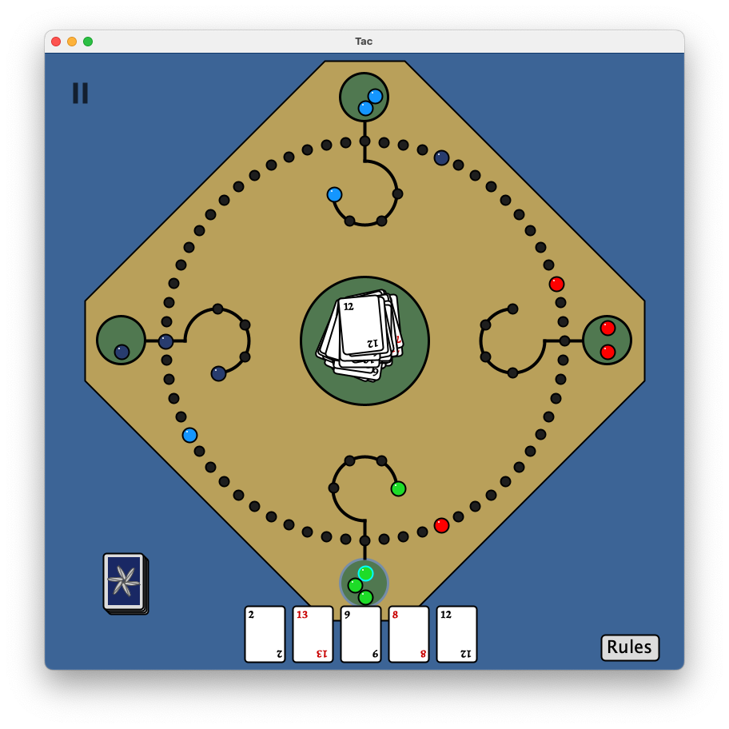

# Tac
Note: This project is **unfinished**. The game still requires a few cards to be implemented and some features are not available yet such as saving and loading a game. I also plan to _rewrite_ most of the code using design patterns such as MVC (Model, View, Controller) to make code more manageable. That being said, the game is playable but you may experience the occasional bug when you or the computer tries to make a move.

___
### About this project
This is a digital version of the german board game 'Tac'. In this game, you compete with your partner across from you to get all of your marbles into the four slots above your starting hole. The first team to get all of their marbles in wins. The rules can be found [here](https://shop.spiel-tac.de/mediafiles/Sonstiges/Anleitungen/TAC-Manual_English.pdf). In this game, the other three players are controlled by the computer.

The game has been made using only Java and its Swing library for graphics.